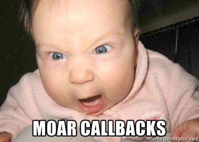

# 5 minute Promises

Ѓорѓи Ќосев

<br><br>

<p style="font-size: 0.5em">можеби 10</p>

-~~-
## Firefox нема време за чекање

Note: Што значи тоа?


-~~-
## Firefox нема време за чекање

```javascript
var user = getCurrentUser();
username.innerText = user.name;
```

Note:
Во горниов код, го прашуваме серверот за моменталниот корисник кој потоа го
сместуваме во променливата `user`. Потоа пристапуваме кон името на корисникот и
го поставуваме елементот username да го прикаже тоа име. Тоа е типичен код во
кој би го напишале во повеќето јазици


-~~-
## Firefox нема време за чекање


```javascript
var user = getCurrentUser();
username.innerText = user.name;
```
Погрешно

Note:

... меѓутоа, тој е погрешен. JavaScript во прелистувачот се извршува во една
нишка. Поради тоа, само еден JavaScript код може да се извршува во даден момент.
Доколку тој код чека на одговор од серверот, корисникот нема да биде во можност
да го користи остатокот од страната. A тој најверојатно и не е баш заинтересиран
да го дознае сопственото име.


-~~-
## Callback функции

Наједноставното решение


-~~-
## Callback функции


```javascript
function showUser(user) {
  username.innerText = user.name;
}
getCurrentUser(showUser);
```


Note:

За да не го блокираме прелистувачот, дефинираме функција `showUser` што
треба да се изврши кога серверот ќе ни го даде корисникот. Функцијата ќе
биде повикана со објектот кој содржи податоци за корисникот како прв параметар.

Потоа, таа функција и ја даваме како аргумент на функцијата `getUser`

-~~-
## Inline форма

```javascript
getCurrentUser(function(user) {
  username.innerText = user.name;
});
```

-~~-
## jQuery $.getJSON

```
function showUser(user) {
  username.innerText = user.name;
}
$.getJSON('/user/current', showUser);
```
Note:

Ова е jQuery варијанта, би требало да им е позната на тие што имаат работено со
jQuery.


-~~-
## Проблем 1: Грешки

Што ако серверот не може да ни го даде моменталниот корисник и ни врати некоја
порака за грешка?

Note:

Како ќе го претставиме тоа?


-~~-
## Решение 1: Додатен аргумент


```javascript
function showUser(err, user) {
  if (err) showError(err);
  else username.innerText = user.name;
}
getCurrentUser(showUser)
```

Note:

Можеме да додадеме аргумент на функцијата `showUser` кој ќе ја
претставува грешката


-~~-
## Проблем 2: Додатни операции


Што ако сакаме да ги земеме пријателите на корисникот?

```javascript
function getCurrentUserFriends() {
  var user = getCurrentUser();
  var friends = getFriends(user);
  return friends;
}
```

Note:
Ова е еквивалентниот блокирачки код. За жал тоа не може да се напише, бидејќи
прелистувачот нема време за чекање. Што ако сакаме да го напишеме во callback
варијанта?


-~~-
## Решение 2: Moar callbacks!



-~~-
## Решение 2: Moar callbacks!


```javascript
function getCurrentUserFriends(callback) {
  getCurrentUser(thenGetFriends)
  function thenGetFriends(err, user) {
    if (err)
      return callback(err);
    getFriends(user, callback);
  }
}
```

* додатен аргумент
* рачно пренесување на грешки

Note:
Ова е callback варијантата. Има две битни разлики. Првата е дека прима додатен
аргумент, callback, кој на крајот го пренесува на функцијата getFriends. Втората
е дека доколку се случи грешка при земањето на моменталниот корисник, мораме
рачно да го сопреме извршувањето и да повикаме `callback(грешка)`

-~~-
## Употреба


```javascript
try {
  showFriends(getCurrentUserFriends(user))
} catch (e) {
  showError(e);
}
```

vs

```javascript
getCurrentUserFriends(function(err, friends) {
  if (err)
    showError(err);
  else
    showFriends(friends);
});
```


-~~-
## Проблем 3: Уште операции


```javascript
function getFriendStatuses() {
  var user = getCurrentUser();
  var friends = getFriends(user);
  return friends.map(getUserStatus);
}
```

Како?


-~~-
## Решение


```javascript
function getFriendStatuses(callback) {
  var statuses = [], statusCount = 0;
  getCurrentUser(userRetreived);
  function userRetreived(err, user) {
    if (err) return callback(err);
    getFreinds(user, friendsRetreived);
  }
  function friendsRetreived(err, friends) {
    if (err) return callback(err);
    statuses = new Array(friends.length);
    friends.forEach(getFriendStatus);
  }
  function getFriendStatus(friend, friendIndex) {
    getStatus(friend, addStatus);
    function addStatus(err, status) {
      if (err) return callback(err);
      statuses[friendIndex] = status;
      statusCount += 1;
      if (statusCount == statuses.length)
        callback(statuses);
    }
  }
}
```

Note: No comment. Исто така, што ако серверот згреши два пати?
Ова не е решение. Што е вистинското решение?


-~~-


-~~-
# Вистинско решение

# Promises!


-~~-
## Што се promises?


Note:
Во JavaScript неможеме да ја вратиме вредноста на корисникот директно од
`getUser`. Но наместо тоа можеме да вратиме Promise, кој ја претставува вредноста
која ќе ја добиеме подоцна.


-~~-
## Што се promises?

* Ветувања кои ја претставуваат незавршената операција
* Можат да бидат исполнети со вредност
* Можат да бидат поништени со грешка
* Штом бидат исполнети или поништени, судбината им е одредена.
* Пред да заврши операцијата се во состојба на чекање


-~~-
## Пример

```javascript
function showName(user) {
  username.innerText = user.name;
}
var promiseForUser = getCurrentUser();
promiseForUser.then(showName);
```

* слично - callbackот оди на then

Note:
Новата варијанта на getCurrentUser не прима callback.
Наместо тоа, враќа вредност која е ветување дека корисникот ќе биде испорачан.
На ова ветување веднаш можеме да закачиме callback функција која ќе ја прими
вредноста на корисникот.

Кога ќе пристигнат податоците за корисникот, promiseForUser ќе биде исполнет
со вредноста на тие податоци. Потоа, автоматски ќе биде повикан callback-от
showName

-~~-
# then(onVal,onErr)

* Зема 1 или 2 аргументи како функции
* Првата функција го добива резултатот
* Втората функција ја добива грешката
<br>
<br>

```javascript
promise.then(function(val) {
  // handle value
}, function(err) {
  // handle error
})
```

-~~-
## Грешки?

```javascript
getCurrentUser().then(showUser, showError);
function showUser(user) {
  username.innerText = user.name;
}
```
* showUser сега веќе не се занимава со грешките,
* showError можеме да ја употребиме директно

Note:
Дали ова е доволно подобрување?


-~~-
# Не е доволно!

Не сме добиле ништо посебно (сè уште)

-~~-
## getCurrentUserFriends

```javascript
function getCurrentUserFriends(callback) {
  getCurrentUser(thenGetFriends)
  function thenGetFriends(err, user) {
    if (err)
      return callback(err);
    getFriends(user, callback);
  }
}
```

-~~-
# VS

-~~-

## getCurrentUserFriends

```javascript
function getCurrentUserFriends() {
  return getCurrentUser().then(getFriends);
}
```

Сега веќе добивме нешто!


-~~-
## Како работи?

```javascript
function getCurrentUserName() {
  var promiseForName = getCurrentUser().then(function(user) {
    return user.name; //name
  });
  return promiseForName;
}
```

```javascript
function getCurrentUserFriends() {
  var promiseForFriends = getCurrentUser().then(function(user) {
    return getFriends(user);
  });
  return promiseForFriends;
}
```

Note:

Функцијата .then, освен што прима callback функции, исто така враќа нов promise!
Тој promise ќе биде исполнет со вредноста вратена од callback функцијата.
Во првиот случај, callback функцијата го враќа името на корисникот, според тоа
.then ќе направи ветување за името на корисникот.

Вториот случај е поинтересен! Во него, callback функцијата враќа ветување за
пријателите на корисникот. Според тоа, резултатот од then ќе биде... ветување за
ветување за пријатели? Не, само едно ветување. Доколку вратиме promise внатре,
.then ќе чека да биде исполнет тој promise и ќе го отпакува автоматски,
оневозможувајќи да добиеме "ветување за ветување".


-~~-
## getFriendStatuses

```javascript
function getFriendStatuses() {
  var pUser = getCurrentUser();
  var pFriends = user.then(getFriends);
  var pStatuses = pFriends.then(function(friends) {
    var statuspArray = friends.map(getUserStatus);
    return Promise.all(statuspArray);
  });
  return pStatuses;
}
```

```javascript
getFriendStatuses().then(showStatuses)
.catch(showError);
```

Note:

Кратко и едноставно. Грешките со кои се немаме справено автоматски се
пренесуваат низ ланецот на promises. Promise.all зема array од promises
и враќа promise за array од вредностите.

Секој promise исто така има .catch метод кој овозможува да се додаде
само callback за грешка. Дали овој метод потсеќа на нешто? (hint: Exceptions)

-~~-
## getFriendStatuses

```javascript
function getFriendStatuses() {
  var pUser = getCurrentUser();
  var pFriends = getFriends(user);
  var statuses = friends.map(getUserStatus);
  return statuses;
}
```

```javascript
try {
  showStatuses(getFriendStatuses());
} catch (error){
  showError(error);
}
```

Note:
Многу сличности меѓу синхрона и асинхрона верзија!


-~~-
## getFriendStatuses


```javasscript
function getFriendStatuses() {
  return getCurrentUser().then(getFriends)
  .then(friends => Promise.all(friends.map(getUserStatus)));
}
```
Со ES6 arrow functions


-~~-
## Како да ги добиеме?

* Firefox 29 ги има!
* Постојат и библиотеки: Q, Bluebird, RSVP.js ...
* Од callbacks

```javascript
function getCurrentUserP() {
  return new Promise(value, error) {
    getCurrentUser(function(err, user) {
      if (err) error(err);
      else value(user);
    });
  });
}
```

-~~-
# Прашања? Време?
